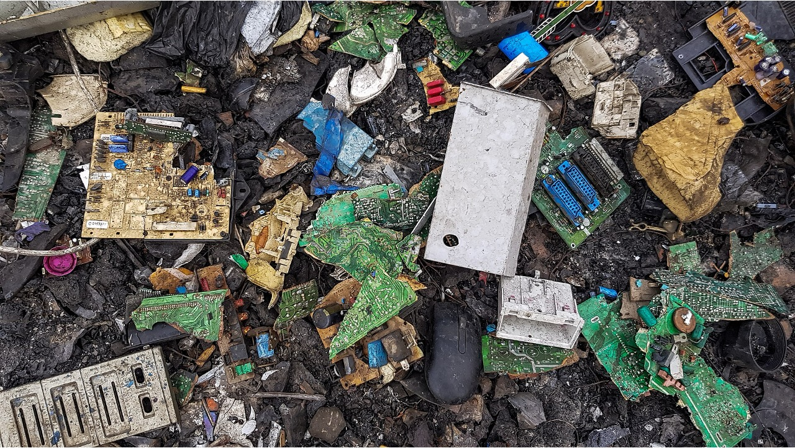
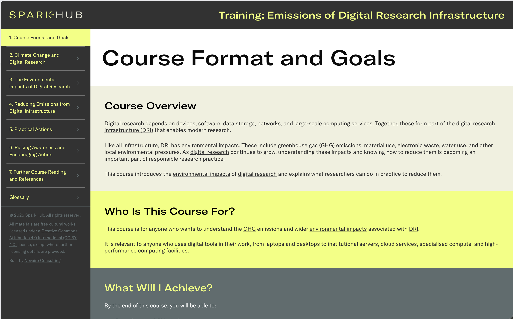
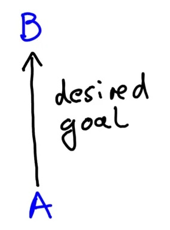
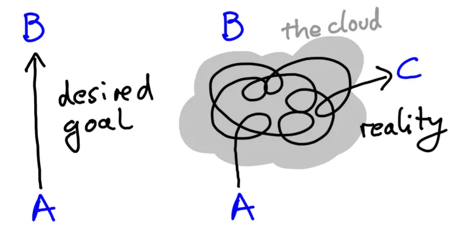
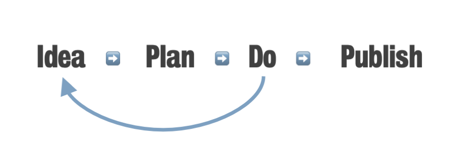
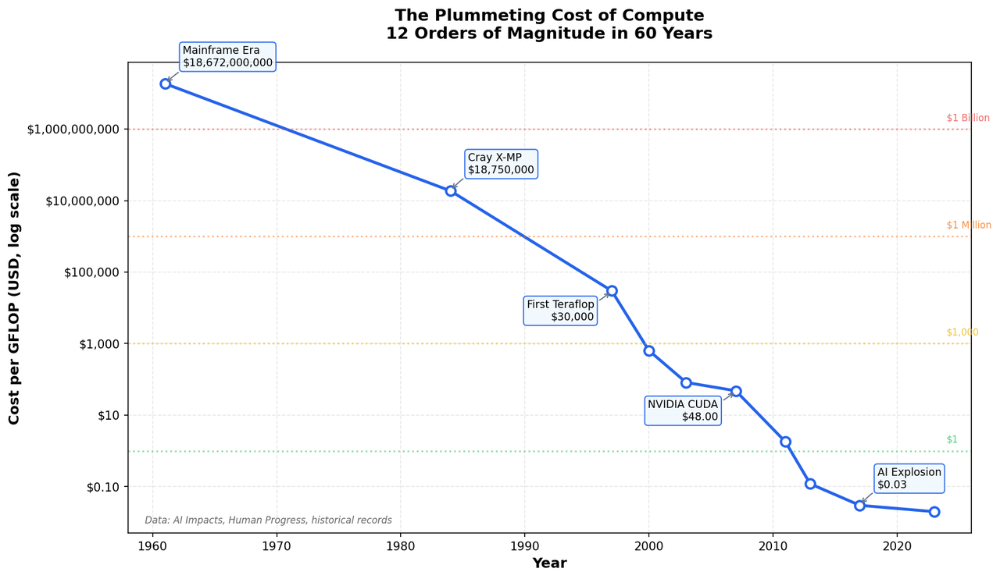

## My story

* PhD (planned): 💻💻💻💻💻🧫🧫🧫🧫🧫

* PhD (actual): 💻💻💻💻💻💻💻💻💻🧫

* Postdoc: 💻💻💻💻💻💻🧫🧫🧫🧫

* Senior postdoc: 💻💻💻💻💻💻💻💻💻💻

* RSE: 💻💻💻💻💻💻💻💻🌱🌱

:::{.notes}
Hello, I'm Liz, and I'm a research software engineer at King's College London.
Before I joined King's I was a researcher, and I did a PhD in biology.
Actually, it was supposed to be 50-50 wetlab biology and computational work, but it ended up being mostly computational.
As a postdoc I did a bit more lab work, but realised that I preferred coding, which is why I looked for RSE jobs.
I've always been interested in coding best practices - making sure the code I write is documented, tested, efficient, and so on.
As an RSE, I work with researchers across King's to help them write code for their research, or adapt or improve existing code to incorporate these best practices.

So why do I mention my background?
Partly, so you know that I've been a PhD student and I know what it's like.
Partly, because as a computational researcher embedded in a wetlab environment, that's where I was first introduced to research sustainability programs.
The institute where I did my PhD (and later came back as a senior postdoc) was really keen on sustainability.
They had greening challenges, schemes to reduce plastic waste in labs, and so on
But nothing that was relevant for people doing computational work
Green DiSC was the thing that made me realise that there are things we can do, and there are people working on this.
From there, I got involved in NetDRIVE.

Aims today: focus on how you can incorporate sustainable computing into your projects and everyday work
:::

## Environmental impacts of computing

{.absolute top="100" left="30" width="400" fig-alt="Graph showing an increase in global data centre energy usage from around 250 TWh in 2020 to around 400 TWh in 2024, and a steeper predicted increase up to almost 1000 TWh in 2030"}
{.absolute top="100" right="30" width="400" fig-alt="Artwork by Dillon Marsh, showing a photo of a copper mine containing a realistic CGI ball of copper."}
{.absolute bottom="0" left="30" width="400" fig-alt="Photograph of a river feeding into a reservoir, with a low water level that reveals an old stone bridge in addition to a modern bridge."}
{.absolute bottom="0" right="30" width="400" fig-alt="Close-up photograph of electronic waste on the ground, including a computer mouse several and broken circuit boards."}

:::{.notes}

Computing impacts the environment in multiple ways:
* Data centres use large amounts of energy, and this is predicted to increase due to demand for things like AI
* Data centres also require water for cooling, which can contribute to water stress and drought
* Producing the hardware that fills these data centres requires mining for metals to make the hardware components
* Finally, electronic waste has to be disposed of, and if not done properly this can also adversely affect the environment
It might seem that our individual contributions are quite small, compared to those of tech giants like Amazon or Google
However, I believe we can all contribute to reducing these environmental impacts
In particular, researchers and open source developers can have more freedom to experiment with new ways of doing things, compared to industry

:::

## Green Software Principles

{fig-align="center" fig-alt="Diagram with the text 'Green software principles' above and the three principles illustrated below. 'Energy efficiency' is illustrated with a battery-like diagram, 'Hardware efficiency' with a computer-like diagrm, and 'Carbon awareness' is illustrated with a small bar chart, with one dark grey bar labelled 'CO2', and a larger green bar. The diagram also includes the Green Software Foundation logo."}

. . . 

**Sufficiency**: do the minimal amount of computing required

:::{.notes}
Aims today: focus on how you can incorporate sustainable computing into your projects and everyday work
So what can we do?

The Green Software Foundation defines three key principles to reduce environmental impact:
* Energy efficiency - using less electricity to do the same analysis task
* Hardware efficiency - using existing hardware well, to avoid buying more hardware
* Carbon awareness - making use of renewable energy, when we can
I'd add one more principle to this, which might be even more important:
* Sufficiency: doing the minimal amount of computing required
:::

## SPARKHub training: Sustainable Digital Research Activities

{fig-align="center"}

:::{.notes}
Along with some of the other NetDRIVE Champions, we put together this online training for SPARKHub.

This presentation is based on some on the content from that training, specifically around some of the practical things you can do as a researcher to reduce the environmental impact of your work, and how these fit into different stages of a research project.

:::

## The research lifecycle

{fig-align="center" width=600}

. . . 

{.absolute top="250" left="400"}

## The research lifecycle {.nostretch}

{fig-align="center"}

::: {style="font-size: 50%;"}
[Uri Alon, 'Why truly innovative science demands a leap into the unknown'](https://www.youtube.com/watch?v=F1U26PLiXjM&source_ve_path=MjM4NTE&embeds_referring_euri=https%3A%2F%2Fwww.imm.ox.ac.uk%2F)
::: 

## The research lifecycle {.nostretch}

{fig-align="center"}

## Where are you in the research lifecycle? {.nostretch}

::::{.columns}
:::{.column}
{fig-align="center" width=300}
:::

:::{.column}
Join at menti.com

Code: 2961 2980
:::
::::

## 📝 Plan

* Experimental design
  * how many replicates / runs do you need? What’s the parameter space? Which comparisons are meaningful?
* Choose the right methods and tools
  * e.g. deep learning vs classical ML approaches
  * newer tools or versions might be more efficient!
* What computational resources do you have access to?
* Do you need to buy new hardware? If so, how can you maximise its use?

:::{.notes}
newer versions: e.g Python 3.11 was 25% faster than the previous version
DNA sequence alignment tool bwa-mem - still widely used, but bwa-mem2 is up to 3x faster with identical results
Do you need a big computer or can you use HPC? Can you use greener HPC?
If you need to buy hardware, can you share it to maximise use? Can you get a longer warranty?
:::

## 📝 Data management plans

* Funders often require data management plans
* Does your supervisor/PI have one? Have you ever seen it?
* DMPs should consider:
  * how much data?
  * where will it be stored?
  * how will it be backed up?
  * will data be published?

## 💻 Do

* Start small - test before scaling up
* Document your work
* Use reproducible workflows
* Measure your resource usage
  * helps make accurate resource requests
  * helps estimate environmental impact
* Consider carbon intensity (time and location)
* Keep data organised

:::{.notes}
test before scaling up - avoid annoying bugs that mean your job fails at the end of a long run
document - remember what you did, so you don't need to re-run it
- recommend keeping an (electronic) lab notebook
what can also help is repro workflow management tools - snakemake or nextflow
define analysis to go from input to output, recalc if params or input change
carbon intensity - CATS scheduler, cloud
data - review your DMP at least once a year, check backups, make a habit of deleting large intermediate files

:::

## 💻 Optimisation

* Identify high-impact opportunities for optimisation
  * long workflows
  * run frequently
  * used by many people
* Profile the code to identify bottlenecks
* **Then** optimise

:::{.notes}
what about making code more efficient?
yes - but it probably shouldn't be the first thing you do, because it can be really time consuming
make sure the code works correctly first
then identify best opportunities
:::

## 💻 How to optimise?

* Data transfer / input / output
* Avoid copying data within your code
* Vectorisation / array broadcasting
* Algorithm scaling

. . .

Resources: [sig-rpc.github.io](https://sig-rpc.github.io/)

:::{.notes}
Optimisation really depends on your code! However, there's some common areas
Avoid transferring data if you can; use efficient file formats
spreadsheet --> csv --> parquet

Caveats:
* Can make code harder to understand
* Can increase maintenance burden

:::

## 💻 Rebound effects

:::{.notes}
Other side effects of increased efficiency - can actually lead to increased demand
Jevons paradox (1865, English economist William Stanley Jevons) originally described how the introduction of more efficient steam engines led to an increase in coal consumption (because steam engines became more widely adopted)
The same can be said of computing - as computing power has become cheaper, chips have become smaller, etc, it's become more widely available
computers in our pockets!
Does more efficient software lead to more demand?
e.g. can examine wider range of parameters
--> rebound effects
consider sufficiency
do you really need to do the extra compute just because you can?
could it be better used for something else?
:::

## 📚 Publish

* Clean up your data
* Publish your data
* Publish your code
* Make sure your documentation is enough to allow reuse

:::{.notes}
At the end of a project it's easy to not spend the time/energy to tidy up
but you should try to clean up your data, delete what you can
if you publish raw data in a public repo you can delete local copies
archive to tape - lower carbon
publishing code is a good idea, helps others reproduce your work - especially if you've made optimisations
neither data nor code are useful if not well documented!
:::

## Effort and impact

::::{.columns}
:::{.column}
{fig-align="center" width=300}
:::

:::{.column}
Join at menti.com

Code: 2961 2980
:::
::::

## Sustainability as good practice

* Newer tools ➡️ efficiency, bug fixes, new functionality
* Efficient code ➡️ saves time, may save money
* Appropriate resource requests ➡️ saves time, may save money
* Good documentation ➡️ reproducibility, easier collaboration, fewer errors
* Reproducibility ➡️ saves time and effort
* Publishing data and code ➡️ open research, easier verification and extension

## What now? 

Think about a current or upcoming project.

What one change would have the biggest impact?

What one thing would help you make that change happen?

## Resources 

:::{.nonincremental}

* [SPARKHub training](https://sdratraining.sparkhub.eu/)
* [Green Software Practitioner training](https://learn.greensoftware.foundation/introduction)
* [Digital Humanities Climate Coalition Toolkit](https://sas-dhrh.github.io/dhcc-toolkit/toolkit/introduction.html)
* [sig-rpc.github.io](https://sig-rpc.github.io/)

:::

## Image credits 

:::{.nonincremental style="font-size: 80%;"}

* Energy: [Nature](https://www.nature.com/articles/d41586-025-01113-z)
* Water: [ITV/PA](https://www.itv.com/news/2023-05-11/seven-regions-in-england-facing-severe-water-stress-this-decade)
* Resources: [Dillon Marsh, "For what it's worth"](https://www.dillonmarsh.com/for-what-its-worth)
* E-waste: [Muntaka Chasant](https://commons.wikimedia.org/w/index.php?curid=75834080), CC BY-SA 4.0
* Green Software Principles: [Green Software Foundation](https://learn.greensoftware.foundation/introduction)
* Cost of compute: [TinyComputers.io](https://tinycomputers.io/posts/the-paradox-of-cheap-compute.html)
* The cloud: [MRC WIMM blog](https://www.imm.ox.ac.uk/about/blog/lessons-from-looking-at-clouds-uri-alon-and-emotions-in-science)

:::